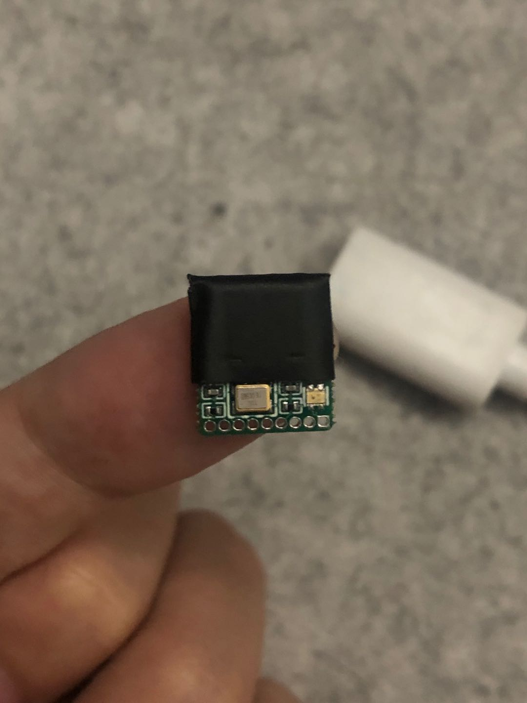
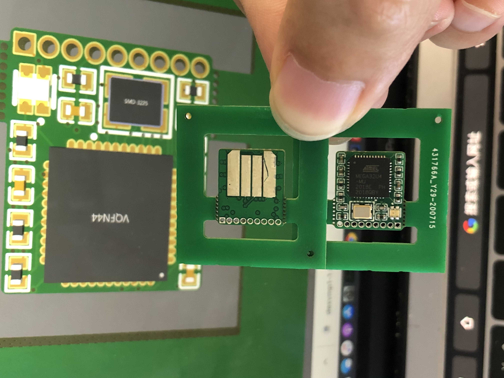
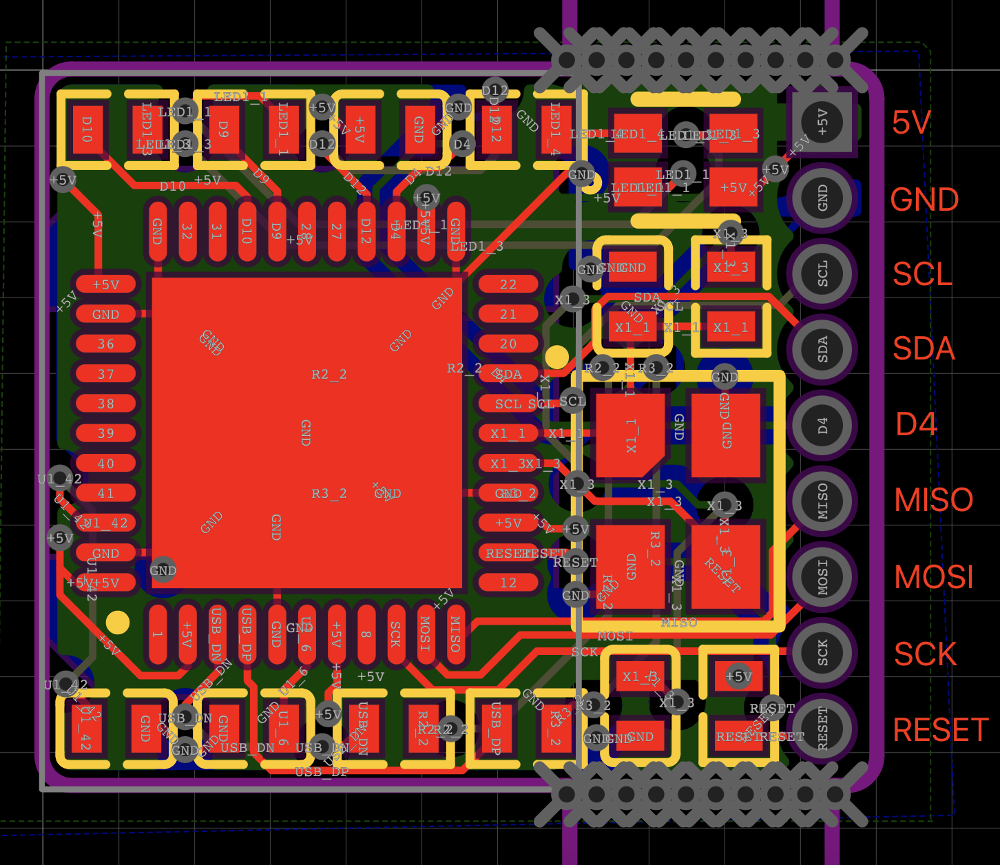

# ThumbIO文档

感谢您支持我的业余项目，请仔细阅读以下文档，如果有更多的问题可以用下面二维码加我的微信（添加时备注硬件爱好者），我拉进开发群一起交流，互相学习。

## ThumbIO简介

- ATMEGA 32U4主控，与Arduino Leonardo、Arduino Pro Micro的主控一样。自带USB控制器，默认bootloader支持USB CDC串口
- 带RGB 三色LED
- 默认固件：RGB呼吸灯

## Arduino环境搭建和固件编译

- **下载Arduino:** http://www.arduino.cc
- Board选择Arduino Leonardo

## RGB Pinout

| AVR Pin | Arduino Pin | Notes |
|  ----  | ----  |  ----  |
| PB5 | 9 | 共阳极RGB中的Red红色（负极，低电平点亮，高电平熄灭） |
| PB6  | 10          | 共阳极RGB中的Green绿色（负极，低电平点亮，高电平熄灭） |
| PD6 | 12 | 共阳极RGB中的Blue蓝色（负极，低电平点亮，高电平熄灭） |

## 1.27mm x 9 Header Pinout

| Arduino Pin | Notes |
|  ----  | ----  |
| +5V | +5V 在方形焊盘的位置（其他是圆形） |
| GND | GND |
| SCL | SCL |
| SDA | SDA                                |
| D4 | Arduino #4 Digital Pin             |
| MISO | SPI MISO |
| MOSI | SPI MOSI |
| SCK | SPI SCK |
| RESET | IC RESET |

## PCB Layout

